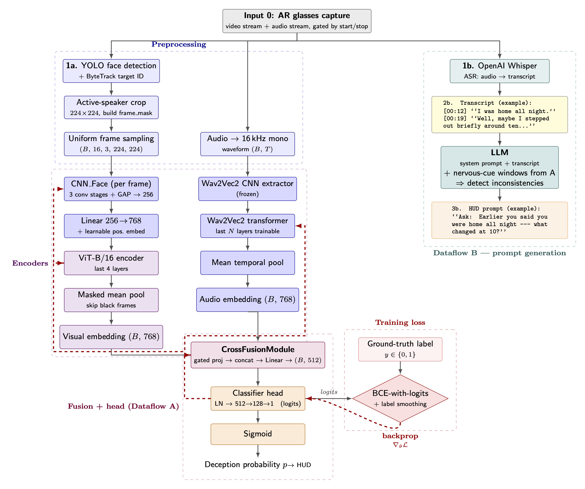

# Lieglass

What if the truth was always visible, and we just never had the right lens?

LieGlass is a pair of AR frames built for investigators and reporters who need more than instinct alone. It routes live audio and video from XReal One glasses and XReal Eye through a multimodal model that derives a continuous deception score and surfaces smart prompts directly into the user's field of view. The model is trained and validated on real-world courtroom trial recordings (RLT) and the DOLOS dataset, grounding its outputs in environments that reflect how reporters and investigators actually work.

Everyone has a tell. Now we have the tools to find it. 🕵️

## Team

| Role                    | Name           |
| ----------------------- | -------------- |
| **Operation Lead**      | Ryan Chen      |
| **Intelligence Agent**  | Brian Jin      |
| **The Whisperer**       | Ella Kim       |
| **Systems Operative**   | Max Pinderski  |

---

## Model Architecture

<p align="center">
  
</p>

LieGlass runs two parallel dataflows on synchronized A/V from the AR glasses:

- **Dataflow A — Multimodal deception score.** A frozen Wav2Vec2 audio backbone and a CNN+temporal-Transformer visual backbone are fused via a multi-stage bidirectional cross-attention head (DOLOS PAVF), producing a continuous probability that the speaker is being deceptive.
- **Dataflow B — Transcript inconsistency.** OpenAI Whisper transcribes speech and an LLM scans the transcript for inconsistencies, generating real-time HUD prompts.

### Fusion model (Dataflow A)

```
waveform (B, T)            frames (B, N, 1, 224, 224)
      |                              |
 Wav2Vec2 (frozen)            CNN_Face (per-frame)
   + UT-Adapter ×12            + temporal Transformer (×4)
      |                          + UT-Adapter ×4
      v                              v
 stages: F_1, F_mid, F_end    stages: F_1, F_mid, F_end
      \________________  ______________/
                       \/
        BidirectionalCrossFusion ×3  (A-V attn + V-A attn -> concat -> head)
                       |
        weighted-sum aggregator  ->  fused (B, d_fused=256)
                       |
                       v
               classifier head -> logit (B,)
```

Key changes from the original DOLOS implementation are documented in
[`MODEL_SPEC.md`](MODEL_SPEC.md).

#### What is trained vs. frozen

| Submodule                                 | Status                                  |
| ----------------------------------------- | --------------------------------------- |
| `Wav2Vec2.feature_extractor`              | **Frozen**                              |
| `Wav2Vec2.feature_projection`             | **Frozen**                              |
| `Wav2Vec2.encoder.layers[*].attention`    | **Frozen**                              |
| `Wav2Vec2.encoder.layers[*].feed_forward` | **Frozen**                              |
| `Wav2Vec2.encoder.layers[*].u_attn / u_ff` | **Trainable** (UT-Adapters)            |
| `Wav2Vec2.encoder.layers[*].an1 / an2`    | **Trainable** (AdapterNorms)            |
| `CNN_Face` spatial encoder                | Trainable (set `freeze_visual_backbone=True` to freeze) |
| Temporal Transformer (incl. UT-Adapters)  | **Trainable**                           |
| `MultiStageFusion` blocks + stage weights | **Trainable**                           |
| Classifier head                           | **Trainable**                           |

The exact frozen/trainable breakdown is printed at the start of each training fold by `print_module_summary()` in `deception_detection/models/model_utils.py`.

---

## Repo layout

```
deception_detection/
  config.py                 ModelConfig dataclass + JSON load/save
  train.py                  k-fold CV trainer with --resume + extensive CLI
  data/                     Dataset, collate, sampler, preprocessing scripts
  models/
    audio_model.py          Wav2Vec2 + UT-Adapter wrapper + multi-stage forward
    visual_model.py         CNN_Face + temporal Transformer + UT-Adapters
    cross_fusion.py         BidirectionalCrossFusion + MultiStageFusion
    fusion_model.py         End-to-end FusionModel (logit output)
    adapters.py             UTAdapter, AdapterNorm, layer wrappers, freeze helper
    model_utils.py          summarize_modules / print_module_summary
Data/
  manifest_dolos.csv        DOLOS only (1,436 clips)
  manifest_mixed.csv        DOLOS + RLT (2,053 clips)
  labels.csv                Detailed behavioral annotations (per-clip)
features/                   Per-clip preprocessed audio/frames
scripts/
  verify_fusion.py          Smoke test: forward shapes, frozen/trainable check
  create_manifest.py        Build a manifest CSV from raw video dirs
checkpoints/<run_id>/       Per-run output dir (created by trainer)
  config.json               Snapshot of ModelConfig used for the run
  splits.json               Per-fold train/val sample IDs
  metrics.json              Per-fold best metrics
  fold_<i>_best.pt          Best model state-dict for fold i (inference)
  last.pt                   Full training state for --resume
```

> All `.mp4` files are stored via Git LFS. Run `git lfs install` once before cloning or pulling.

---

## Setup

```bash
conda activate LieGlass            # or your venv of choice
cd lieglass-dsc
git lfs pull                       # fetch .mp4 binaries
```

---

## Preprocessing

Resize source clips and extract per-frame tensors + audio:

```bash
python -m deception_detection.data.preprocessing.preprocess_resized \
    --manifest Data/manifest_mixed.csv \
    --resized_dir Data/Combined \
    --feature_dir features \
    --workers 4 \
    --force

python -m deception_detection.data.preprocessing.extract_frames \
    --manifest Data/manifest_mixed.csv \
    --resized_dir Data/Combined \
    --feature_dir features \
    --workers 4 \
    --force
```

---

## Training

### Fresh run (defaults)

```bash
python -m deception_detection.train \
    --manifest Data/manifest_mixed.csv \
    --feature_dir features
```

This creates `checkpoints/<timestamp>/` with `config.json`, `splits.json`,
`metrics.json`, `fold_<i>_best.pt`, and `last.pt`.

### Common overrides

```bash
python -m deception_detection.train \
    --manifest Data/manifest_mixed.csv \
    --feature_dir features \
    --epochs 80 \
    --batch_size 8 --grad_accum 8 \
    --lr 4e-5 --weight_decay 0.20 \
    --use_ut_adapters true \
    --ut_adapter_dim 128 \
    --audio_fusion_layers 4,8,12 \
    --visual_fusion_layers 1,2,4 \
    --fusion_aggregator weighted_sum
```

### Loading a config file

Every CLI flag has a corresponding `ModelConfig` field. You can capture a configuration to JSON and reuse it:

```bash
python -m deception_detection.train --config configs/my_run.json
# CLI flags applied AFTER --config override the file values.
python -m deception_detection.train --config configs/my_run.json --epochs 30
```

### Resuming a run

`last.pt` is rewritten atomically at the end of every epoch. To continue:

```bash
python -m deception_detection.train --resume checkpoints/20260429_103045/last.pt
```

The trainer skips folds completed before the checkpoint, restores the model /
optimizer / `OneCycleLR` / AMP scaler / RNG / patience / best-AUC, and resumes
from the saved epoch + 1 inside the in-flight fold.

### Inspecting frozen vs. trainable modules

At the start of each fold, the trainer prints a per-submodule breakdown
collapsing repeated structures with `×N` (e.g. `Wav2Vec2.encoder.layers[*].u_attn`).
To inspect a model in isolation:

```bash
python scripts/verify_fusion.py
```

This builds a `FusionModel`, runs a dummy batch, prints the breakdown, and
verifies that the frozen Wav2Vec2 attention weights have no gradients while the
UT-Adapters do.

### Full CLI reference

All knobs are listed via `python -m deception_detection.train --help`. Highlights:

| Flag                          | Purpose                                                     |
| ----------------------------- | ----------------------------------------------------------- |
| `--config <path>`             | Load `ModelConfig` from JSON; CLI flags still override.     |
| `--resume <path>`             | Resume from a `last.pt` checkpoint.                         |
| `--manifest`, `--feature_dir`, `--checkpoint_dir` | Data paths.                            |
| `--epochs`, `--folds`, `--seed`, `--patience`     | Training schedule.                     |
| `--batch_size`, `--grad_accum`, `--max_frames`    | Memory/throughput knobs.               |
| `--lr`, `--weight_decay`, `--label_smoothing`, `--grad_clip`, `--dropout` | Optimizer/regularization. |
| `--use_ut_adapters`, `--ut_adapter_dim`, `--ut_conv_kernel` | UT-Adapter shape.            |
| `--audio_fusion_layers 4,8,12` | 1-indexed Wav2Vec2 layers tapped for multi-stage fusion.   |
| `--visual_fusion_layers 1,2,4` | 1-indexed temporal-transformer layers tapped for fusion.   |
| `--fusion_aggregator {sum,weighted_sum}` | How per-stage fused vectors are combined.         |
| `--fusion_n_heads`, `--fusion_dropout` | Cross-attention block hyperparameters.               |
| `--wav2vec2_unfreeze_last_n`  | Only used when `--use_ut_adapters=False` (legacy fine-tune).|
| `--vit_n_layers`, `--vit_n_heads`, `--freeze_visual_backbone` | Visual encoder shape.    |

---

## Inference

Single-clip inference using a trained checkpoint:

```bash
python Inference.py \
    --video features/BRI_WILTY_EP64_truth_1/video.mp4 \
    --audio features/BRI_WILTY_EP64_truth_1/audio.wav \
    --checkpoint checkpoints/<run_id>/fold_0_best.pt
```

---

## Datasets

- **DOLOS** — `Data/manifest_dolos.csv` (1,436 clips). Source: NMS05/Audio-Visual-Deception-Detection.
- **Real-Life Trial (RLT)** — combined into `Data/manifest_mixed.csv` (2,053 clips total). Original release: Pérez-Rosas et al., 2015.
- **labels.csv** — per-clip behavioral annotations (smile, scowl, blinking, head movement, vocal tension, etc.).
