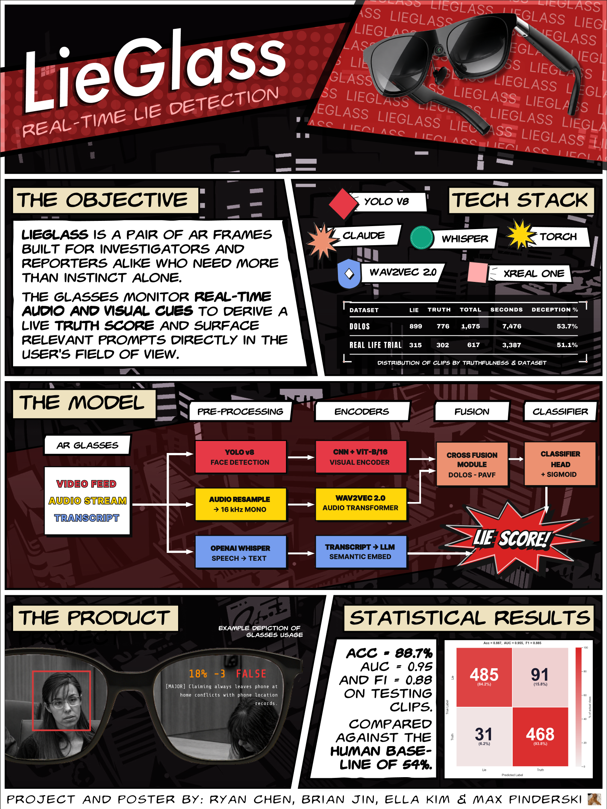

## LieGlass
> *Ryan Chen, Brian Jin, Ella Kim & Max Pinderski*

Lieglass is an AR glasses system designed for investigators and reporters that monitors real-time audio and visual cues to generate a live truth score displayed directly in the user's field of view. The system runs two parallel pipelines: a multimodal deception classifier (combining YOLOv8 face detection, a CNN+ViT visual encoder, and a Wav2Vec 2.0 audio transformer with cross-modal fusion) alongside an LLM-based semantic analysis pipeline that uses OpenAI Whisper for transcription and Claude for detecting inconsistencies in speech content. The hardware platform is the XREAL One AR frame, with the backend built on FastAPI. Trained and evaluated on the DOLOS dataset and real-life trial footage, the model achieves 88.7% accuracy, an AUC of 0.95, and an F1 of 0.88, well above the 54% human baseline.

## Model Architecture

  

  <em>
    Architecture overview of the Lie Glass model. AR glasses capture a synchronized video and audio stream, 
    which is processed through two parallel dataflows. Dataflow A extracts visual embeddings via a 
    ViT-B/16 encoder and audio embeddings via a frozen Wav2Vec2 transformer, fusing them through a 
    CrossFusionModule into a deception probability score. Dataflow B transcribes speech with OpenAI 
    Whisper and passes the transcript to an LLM to detect inconsistencies, generating real-time 
    HUD prompts. The model is trained end-to-end with BCE-with-logits loss and label smoothing.
  </em>

## Project Poster

  

# lieglass-dsc

All mp4 files are LFS pointers. Make sure to have Git LFS setup correctly before cloning or pulling.

Run: 
# From project root
python -m deception_detection.data.preprocessing.preprocess_resized \
    --manifest Data/manifest_mixed.csv \
    --resized_dir Data/Combined \
    --feature_dir features \
    --workers 4 \
    --force
    
python -m deception_detection.data.preprocessing.extract_frames \
    --manifest Data/manifest_mixed.csv \
    --resized_dir Data/Combined \
    --feature_dir features \
    --workers 4 \
    --force

conda activate LieGlass
cd Shared/
cd Shared\ Vault/
cd Projects/
cd Dammit/
cd lieglass-dsc/

python -m deception_detection.train \
    --manifest Data/manifest_mixed.csv \
    --feature_dir features | tee output.txt
    
    
BRI_WILTY_EP64_truth_1

python Inference.py \
    --video features/BRI_WILTY_EP64_truth_1/video.mp4 \
    --audio features/BRI_WILTY_EP64_truth_1/audio.wav \
    --checkpoint checkpoints/fold_0_best.pt
